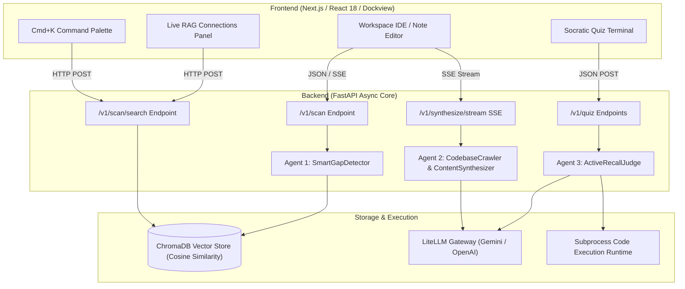
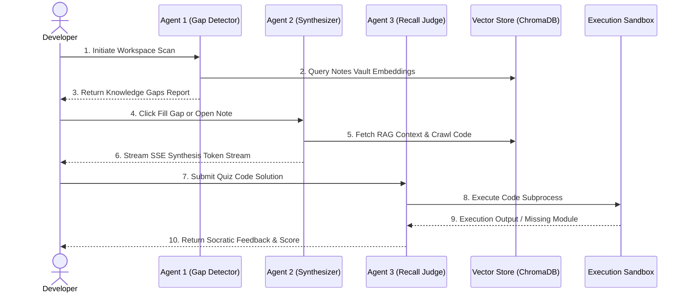
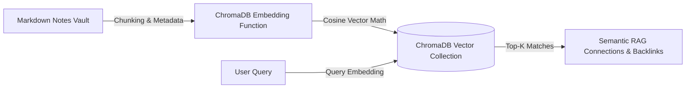
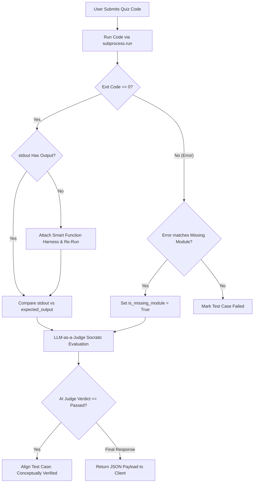

<div align="center">

# 🌌 OmniVault AI

### *Autonomous Codebase Knowledge Vault & Socratic Spaced-Repetition Engine*

[](https://fastapi.tiangolo.com/)
[](https://react.dev/)
[](https://www.typescriptlang.org/)
[](https://www.trychroma.com/)
[](https://github.com/BerriAI/litellm)
[](https://www.python.org/)
[](LICENSE)

---

**OmniVault** is an AI-powered documentation coverage, knowledge gap detection, and Socratic learning environment. It bridges local **Obsidian Markdown Note Vaults** with real-world **Codebases** using AST parsing, ChromaDB semantic vector embeddings, a 3-agent orchestration system, and isolated code execution sandboxes.

</div>

---

## 📑 Table of Contents

- [✨ Key Features](#-key-features)
- [🏗️ System Architecture](#️-system-architecture)
- [🤖 3-Agent System Architecture](#-3-agent-system-architecture)
  - [1. Agent 1: SmartGapDetector (AST & Import Analysis)](#1-agent-1-smartgapdetector-ast--import-analysis)
  - [2. Agent 2: CodebaseCrawler & ContentSynthesizer (Code-Aware RAG Synthesis)](#2-agent-2-codebasecrawler--contentsynthesizer-code-aware-rag-synthesis)
  - [3. Agent 3: ActiveRecallJudge (Socratic Quiz & Sandbox Judge)](#3-agent-3-activerecalljudge-socratic-quiz--sandbox-judge)
- [🔬 Exhaustive Backend Concepts Breakdown](#-exhaustive-backend-concepts-breakdown)
  - [⚡ FastAPI Async Core & Streaming Architecture](#-fastapi-async-core--streaming-architecture)
  - [🧠 ChromaDB Semantic Vector Store & RAG Engine](#-chromadb-semantic-vector-store--rag-engine)
  - [📦 Non-Blocking Sandbox Execution & Fallback Engine](#-non-blocking-sandbox-execution--fallback-engine)
  - [🛠️ Smart Function Driver Harness](#️-smart-function-driver-harness)
- [🖥️ User Interface & Interactive Workflows](#️-user-interface--interactive-workflows)
- [🚦 Quickstart & Local Setup](#-quickstart--local-setup)
- [🧪 Sample Testing Workspace](#-sample-testing-workspace)

---

## ✨ Key Features

- 📝 **Pure Markdown Note-Taking App Mode**: Operates as a full-featured Obsidian-style Markdown notebook with note tree navigation, live preview, `[[WikiLinks]]`, backlinks, and visual node graphs.
- ⚡ **1-Click AI Synthesis & Auto-Streaming**: Automatically streams detailed technical documentation generated from real codebase symbols using Server-Sent Events (SSE).
- 🔍 **Global `Cmd+K` / `Ctrl+K` RAG Command Palette**: Instant debounced semantic vector search across notes, knowledge gaps, and codebase references.
- 🔗 **Live RAG Connections Panel**: Real-time sidebar inside the note editor displaying ChromaDB vector similarity matches with percentage scores and incoming `[[WikiLinks]]` backlinks.
- 🎓 **Socratic Quiz & Execution Sandbox**: Interactive technical quizzes with code execution sandboxes for Python and JavaScript, powered by an LLM Socratic Judge.
- 🛡️ **Non-Blocking Missing Package Fallback**: Evaluates user code logic conceptually when third-party libraries (e.g., `sklearn`, `pandas`, `torch`) are not pre-installed in the execution runtime.

---

## 🏗️ System Architecture

OmniVault adopts a decoupled 3-tier architecture: a modern Next.js/React frontend with Dockview workspace management, an asynchronous FastAPI backend service, and an embedded ChromaDB vector store.



---

## 🤖 3-Agent System Architecture

OmniVault is driven by three specialized AI agents working together:



### 1. Agent 1: SmartGapDetector (AST & Import Analysis)
- **Primary Class**: `app.agents.gap_detector.SmartGapDetector`
- **Responsibilities**:
  - Parses Python files using Python's native `ast` module (`ast.parse`) to extract top-level imports (`Import`, `ImportFrom`) and function signatures.
  - Parses JavaScript/TypeScript source files using regex pattern matching (`re`) to capture ES6 `import` statements and `require(...)` calls.
  - Extracts declared dependencies from `package.json` and `requirements.txt`.
  - Compares extracted technical concepts against the existing markdown note vault (indexed in ChromaDB) to pinpoint **unmapped technical debt and missing documentation gaps**.

### 2. Agent 2: CodebaseCrawler & ContentSynthesizer (Code-Aware RAG Synthesis)
- **Primary Classes**: `app.agents.codebase_crawler.CodebaseCrawler` & `app.agents.synthesizer.ContentSynthesizer`
- **Responsibilities**:
  - **Codebase Crawler**: Performs regex scans across connected workspace code files to locate actual function definitions (`def`, `async def`, `function`), classes, decorators (`@app.get`, `@router.post`), and surrounding 5-line implementation snippets.
  - **Content Synthesizer**: Injects real code snippets and ChromaDB semantic context into LiteLLM prompts, streaming structured markdown documentation back to the user via Server-Sent Events (SSE).

### 3. Agent 3: ActiveRecallJudge (Socratic Quiz & Sandbox Judge)
- **Primary Class**: `app.agents.recall_judge.ActiveRecallJudge`
- **Responsibilities**:
  - Generates technical recall quiz challenges based on vault note contents.
  - Evaluates user-submitted code by running it inside an isolated subprocess (`_run_python_code` / `_run_javascript_code`).
  - Implements a **Smart Function Driver Harness** that automatically invokes user-defined functions with test inputs.
  - Enforces a **Non-Blocking Missing Package Fallback**: if code fails due to missing host libraries (e.g., `sklearn` or `pandas`), the agent evaluates the code conceptually and marks it as passed if the logic is correct.

---

## 🔬 Exhaustive Backend Concepts Breakdown

### ⚡ FastAPI Async Core & Streaming Architecture

OmniVault's backend is built on **FastAPI** using asynchronous endpoints (`async def`) and non-blocking I/O.

#### Server-Sent Events (SSE) Streaming (`/v1/synthesize/stream`)
Traditional HTTP request-response cycles wait for the entire LLM completion before responding. OmniVault uses `EventSourceResponse` from `sse_starlette.sse` to stream markdown synthesis to the frontend token-by-token:

```python
@router.post("/stream")
async def stream_synthesize_note(payload: SynthesizeRequest):
    async def event_generator():
        # Iterate asynchronously over LiteLLM streaming tokens
        for chunk in synthesizer.generate_note_stream(
            topic=payload.topic,
            notes_files=payload.notes_files,
            project_files=payload.project_files
        ):
            yield {"event": "message", "data": json.dumps({"content": chunk})}
        yield {"event": "done", "data": json.dumps({"status": "completed"})}

    return EventSourceResponse(event_generator())
```

#### Real-Time WebSockets Graph Manager (`/ws`)
OmniVault maintains a global `ConnectionManager` that broadcasts graph updates and debt metrics to connected workspace clients whenever a scan or note update occurs:

```python
class ConnectionManager:
    def __init__(self):
        self.active_connections: list[WebSocket] = []

    async def broadcast(self, message: dict):
        for connection in self.active_connections:
            await connection.send_json(message)
```

---

### 🧠 ChromaDB Semantic Vector Store & RAG Engine

The vector store service (`app.services.vector_store.VectorStoreService`) manages document embeddings and semantic search using **ChromaDB**.



#### Dual-Mode Indexing Mechanics
1. **Stateless In-Memory Mode (`index_notes_vault_in_memory`)**:
   - Used when files are uploaded ephemerally via directory handles in the browser.
   - Instantiates an in-memory `EphemeralClient()` and generates vector collections on-the-fly.
2. **Persistent Disk Mode (`index_notes_vault`)**:
   - Used for local directory paths. Persists vector indexes to `./chroma_db/`.

#### Cosine Similarity Search
Queries are matched using cosine distance:

$$\text{Cosine Similarity} = \frac{\mathbf{A} \cdot \mathbf{B}}{\|\mathbf{A}\| \|\mathbf{B}\|}$$

Distance values returned by ChromaDB are converted to user-facing similarity percentages:

$$\text{Similarity \%} = \max(0, (1 - \text{distance})) \times 100$$

---

### 📦 Non-Blocking Sandbox Execution & Fallback Engine

When a user submits code to the Socratic Quiz Judge, OmniVault executes the code in an isolated subprocess (`subprocess.run`) with a 10.0-second timeout limit.



#### Missing Module Detection Logic
If code execution fails due to uninstalled server libraries (e.g. `ModuleNotFoundError: No module named 'sklearn'`), the runner catches the `stderr` pattern:

```python
match = re.search(
    r"(?:ModuleNotFoundError|ImportError):\s*(?:No module named ['\"]([^'\"]+)['\"]|cannot import name ['\"]([^'\"]+)['\"])", 
    stderr
)
if match:
    is_missing_module = True
    missing_module_name = match.group(1) or match.group(2)
```

The system prompt instructs the AI Judge:
> *"If sandbox execution logs contain `is_missing_module: true`, THIS IS A SERVER HOST ENVIRONMENT LIMITATION. DO NOT FAIL THE USER FOR A MISSING SERVER PACKAGE! Evaluate the user's code conceptually based on syntax, structure, API usage, data flow, and problem-solving logic. If their code correctly implements the requested functionality, MARK IT AS PASSED (`passed: true`)."*

---

### 🛠️ Smart Function Driver Harness

When developers write function-based quiz solutions (e.g. `def predict_next_number(previous_numbers): return ...`), they don't include top-level `print()` statements. Without a harness, execution produces empty stdout (`No output`).

OmniVault automatically appends a smart invocation harness when a function definition is detected:

```python
# --- OmniVault Smart Test Harness Driver ---
if __name__ == '__main__':
    import sys, json, ast
    raw_in = sys.stdin.read().strip()
    if raw_in:
        _funcs = [
            obj for name, obj in list(locals().items()) 
            if callable(obj) and getattr(obj, '__module__', None) == '__main__' and not name.startswith('_')
        ]
        if _funcs:
            _target = _funcs[-1]
            try:
                try:
                    _val = json.loads(raw_in)
                except Exception:
                    _val = ast.literal_eval(raw_in)
                _res = _target(*_val) if isinstance(_val, tuple) else _target(_val)
                if _res is not None:
                    print(_res)
            except Exception:
                pass
```

---

## 🖥️ User Interface & Interactive Workflows

| View Component | Description |
| :--- | :--- |
| **Markdown Note-Taking App** | Full obsidian-style markdown editor with note tree navigation, `[[WikiLinks]]`, and node graphs. |
| **`Cmd+K` Command Palette** | Debounced semantic RAG search across notes, debt gaps, and codebase references. |
| **RAG Connections Sidebar** | Live sidebar inside note editor showing vector matches (% similarity) & incoming backlinks. |
| **Socratic Quiz Terminal** | Interactive terminal for code execution, test cases, and Socratic AI feedback hints. |
| **Code Analyzer Modal** | Workspace dialog to connect local codebase folders and trigger AI AST gap analysis. |

---

## 🚦 Quickstart & Local Setup

### Prerequisites
- **Python**: `3.10` or higher
- **Node.js**: `v18.0.0` or higher
- **API Key**: Gemini API Key or OpenAI API Key

### 1. Backend Setup

```bash
# Clone repository
git clone https://github.com/kritika-ghosh/OmniVault.git
cd OmniVault/backend

# Create virtual environment
python -m venv venv
# On Windows:
venv\Scripts\activate
# On Linux/macOS:
source venv/bin/activate

# Install dependencies
pip install -r requirements.txt

# Set Environment Variables
export GEMINI_API_KEY="your-gemini-api-key"
# On Windows PowerShell:
# $env:GEMINI_API_KEY="your-gemini-api-key"

# Launch Backend Server
uvicorn app.main:app --reload --port 8000
```

### 2. Frontend Setup

```bash
# Navigate to frontend directory
cd ../frontend/frontend

# Install Node modules
npm install

# Start Next.js Development Server
npm run dev
```

Open `http://localhost:3000` in your browser to launch OmniVault!

---

## 🧪 Sample Testing Workspace

OmniVault includes a pre-configured sample testing workspace inside `testing folder/`:

- **Codebase Path**: [`testing folder/pomodoro-app`](file:///d:/Desktop/projects/OmniVault/testing%20folder/pomodoro-app) (React, Zustand, Framer Motion, Recharts, Howler, Web Workers, Web Audio API).
- **Notes Vault Path**: [`testing folder/frontend-notes`](file:///d:/Desktop/projects/OmniVault/testing%20folder/frontend-notes) (4 basic markdown notes).

> [!TIP]
> Open `testing folder/frontend-notes` in OmniVault, then click **Code Analyzer** and select `testing folder/pomodoro-app` to instantly discover **20+ technical knowledge gaps**!

---

<div align="center">

**Built with ❤️ for Google Antigravity & Hackathons**

</div>
